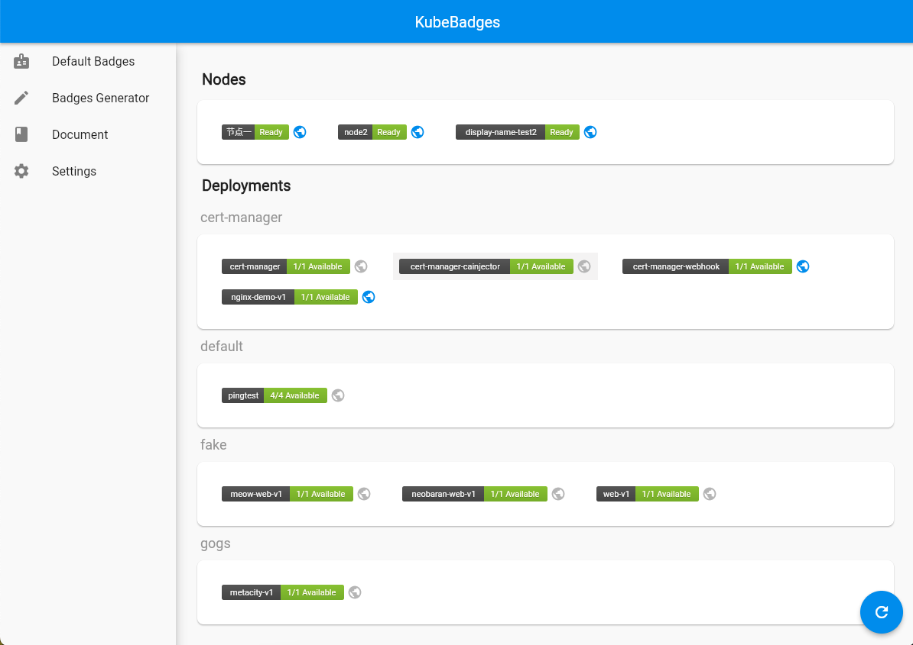

# KubeBadges


## What is KubeBadges
KubeBadges is an open-source Kubernetes status display tool designed to provide concise, intuitive status badges for services within Kubernetes. It offers instant status feedback while reducing external dependencies and complexity.



## Features

- **Status Badge Generation:** Easily generate status badges for various resources within Kubernetes, such as services, Pods, and Deployments.
- **Badge Customization:** Users can customize badges flexibly through KubeBadges' control panel, including attributes like color and name.
- **Custom Probes:** Users can extend the system functionality by defining and configuring their probes to display specific service data.
- **Custom Service Names:** Provide easily understandable aliases or display names for services in Kubernetes.
- **Minimum Privilege Policy:** Use Kubernetes' RBAC to ensure that KubeBadges only accesses the data it needs with minimal permissions.

## Getting Started

### Install
```bash
kubectl apply -f https://raw.githubusercontent.com/kubebadges/kubebadges/main/manifests/install.yaml
```

### Install with Helm
```bash
helm repo add kubebadges https://kubebadges.github.io/kubebadges
helm install kubebadges kubebadges/kubebadges -n kubebadges --create-namespace
```

### Verify KubeBadges is running
```bash
kubectl get pods -n kubebadges
```

### Access KubeBadges Dashboard
```bash
kubectl port-forward svc/kubebadges 8090:8090 -n kubebadges
```
Open your browser and navigate to http://localhost:8090 to access the KubeBadges management dashboard.
Set up the necessary permissions in the KubeBadges dashboard to allow external access to the badges.

### Set Up External Access for Badges
KubeBadges dashboard runs on port 8090, while the external API uses port 8080. If you need to access badges from outside the cluster, you will need to configure Ingress or other means of exposure for KubeBadges' port 8080.


## Advantages

- **Simplified Workflow:** KubeBadges simplifies the complexity of viewing service status, providing a centralized and easy-to-manage solution.
- **No External Dependencies:** Because all data is stored within the Kubernetes cluster, there is no need for external databases or other services.
- **Secure and Reliable:** KubeBadges uses a minimum privilege policy to ensure data security.
- **Highly Customizable:** From the appearance of badges to custom probe data points, everything can be tailored to meet specific needs.

## License
[Apache License Version 2.0](./LICENSE)
